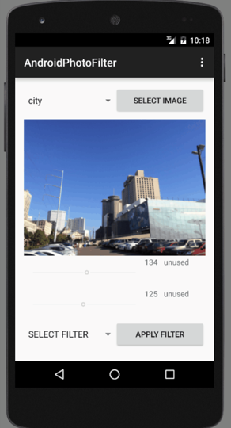

I developed the app using Android Studio V1.3.1 on the Android SDK V23 (Marshmallow).  The emulator used to develop the app is the Nexus 5 API 23 x86.

The App is laid out in the following way:
-The image is selected via a pull down menu and loaded by hitting the “SELECT IMAGE” button.
-When the image is selected, it is loaded on the screen
-Under the image, there are two seekbars that can be used to dynamically manipulate values related to the chosen filter.  Some filters use both seekbars, only one, or none.  The value related to the seekbar is displayed on the screen.
-The value that the seekbar is modifying is also displayed on the screen for the user.
-When a seekbar is not utilized for the chosen filter, it is deactivated and the label is changed to “unused”
-The filter is chosen via a pull down menu on the bottom of the screen and applied by hitting the “APPLY FILTER” button.

Note: the values on the seekbar are applied dynamically so that you can see the effect of the value on the image as the 

